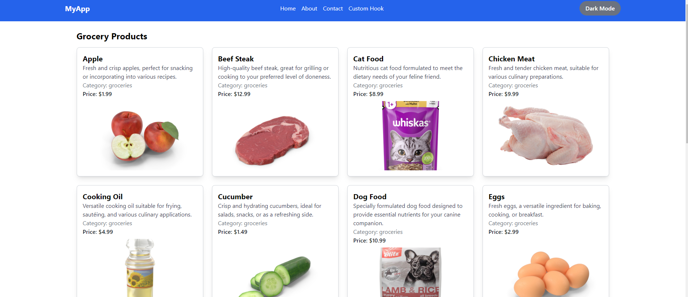
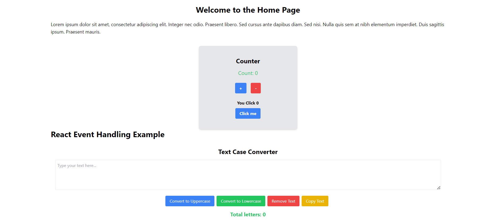

# React.js Project: Counter, Event Handling, API Fetch, Dark/Light Mode, Custom Hook

## Description
This project demonstrates a simple counter, event handling, fetching data from a dummy API, and implementing dark/light mode using Context API in React.js. Additionally, it includes a custom hook for reusable logic.

## Features
- Counter with increment/decrement functionality.
- Event handling for user interactions.
- Fetching and displaying data from a dummy API.
- Dark and light mode toggle using Context API.
- Custom hook for shared logic.

## Screenshot

## Installation
1. Clone the repository.
2. Install dependencies with `npm install`.
3. Run the project with `npm start`.

## Usage
- Toggle between dark and light mode.
- Fetch data from the API and display it.
- Interact with the counter component.

## Technologies Used
- React.js
- Context API
- Custom Hooks
- CSS

## License
This project is licensed under the MIT License.
